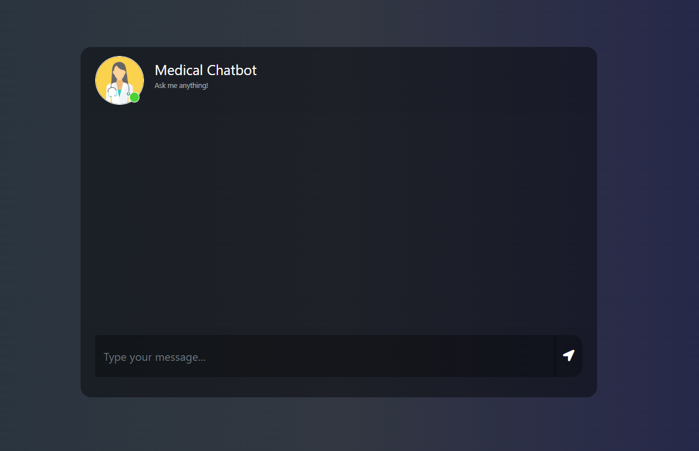

# Medical Chatbot - Generative AI

## Overview
A full-stack medical chatbot using Generative AI, Pinecone vector search, and Hugging Face embeddings. Users can ask medical questions and receive concise, context-aware answers from PDF medical documents.

## Demo


## Features
- Chatbot web UI (Flask + Bootstrap)
- RAG (Retrieval Augmented Generation) pipeline
- Pinecone vector database for semantic search
- Hugging Face sentence-transformers for embeddings
- Ollama/LLM or OpenAI for answer generation
- Easy PDF ingestion

## Folder Structure
```
medical-chatbox/
├── app.py                # Flask web app
├── store_index.py        # Build Pinecone index from PDFs
├── src/
│   ├── helper.py         # Data loading, splitting, embedding
│   └── prompt.py         # System prompt for LLM
├── Data/                 # PDF files for ingestion
├── templates/
│   └── chat.html         # Chatbot UI
├── static/
│   └── style.css         # UI styles
├── requirements.txt      # Python dependencies
├── .env                  # API keys
└── research/
    └── trials.ipynb      # Experiments
```

## Quick Start

### 1. Clone & Setup Environment
```bash
git clone <your-repo-url>
cd medical-chatbox
conda create -n medibot python=3.10 -y
conda activate medibot
```

### 2. Install Dependencies
```bash
pip install -r requirements.txt
```

### 3. Prepare API Keys
Create a `.env` file in the project root:
```
PINECONE_API_KEY=your_pinecone_key
```
If using OpenAI or Ollama, add:
```
OPENAI_API_KEY=your_openai_key
```

### 4. Add PDF Data
Place your medical PDFs in the `Data/` folder.

### 5. Build Pinecone Index
```bash
python store_index.py
```

### 6. Run the Web App
```bash
python app.py
```
Visit [http://localhost:8080](http://localhost:8080) in your browser.

## Usage
- Type your medical question in the chat box.
- The bot retrieves relevant context from PDFs and answers concisely.

## Troubleshooting
- **ImportError**: Check your `requirements.txt` and Python version (3.10 recommended).
- **Pinecone errors**: Ensure your API key is valid and index name matches in all scripts.
- **No response**: Make sure you have run `store_index.py` and have PDFs in `Data/`.
- **Ollama errors**: Install Ollama and pull model (`ollama pull llama2`).

## Customization
- Edit `src/prompt.py` to change system prompt.
- Add more PDFs to `Data/` for richer context.
- Change LLM provider in `app.py` (Ollama, OpenAI, etc).


## License
MIT

## Authors
- DuyNguyen-github
